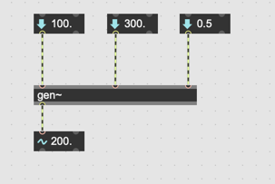
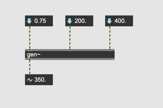
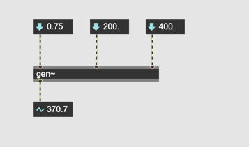
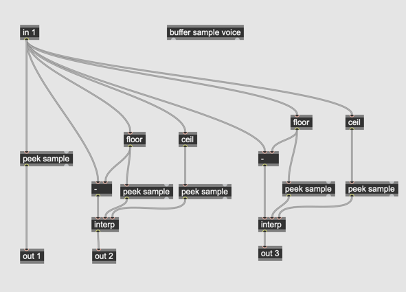
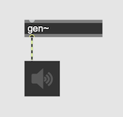
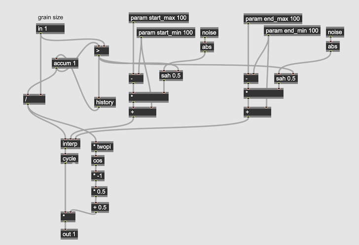

# Klasse3

## gen~ Objekte

### mix ... linear interpolation

#### Funktion

#### Anwendungsbeispiel (Waveform Interpolation)

 

### interp ... fortgeschrittene interpolation

#### Funktion

##### linear interpolation

##### cosine interpolation

[Interpolation](http://paulbourke.net/miscellaneous/interpolation/)

#### Anwendungsbeispiel (Buffer interpolation)

## Particle synthesis mit gen~ (1)

[Excerpt microsound](Klasse3/particle.pdf)

### Glissonsynthese

#### Schritt 1

Sinus aus gen~

#### Schritt 2

interp und glissando

#### Schritt 3

param in

#### Schritt 4

range in

#### Schritt 5

grain size

#### Schritt 6

Fensterfunktion

#### Schritt 7

Mit waveform

#### Schritt 8

Mit Sample

