# Klasse6


## Filter mit gen

## FIR Filter
### Simple Low-pass

y[n] = (0.5 * x[n]) + (0.5 * x[n-1])

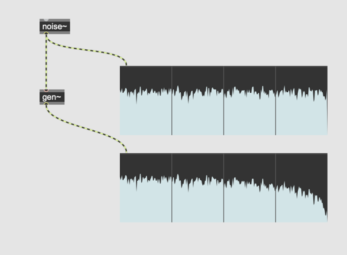
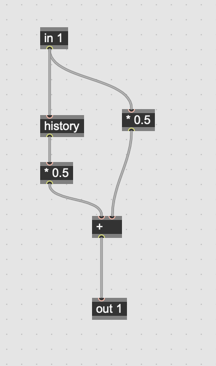

### Simple High-pass

y[n] = (0.5 * x[n]) - (0.5 * x[n-1])

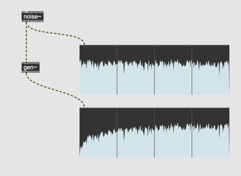
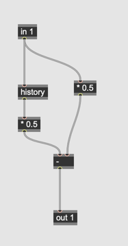

### Variable Coef

y[n] = (a0 * x[n]) + (a1 * x[n-1])


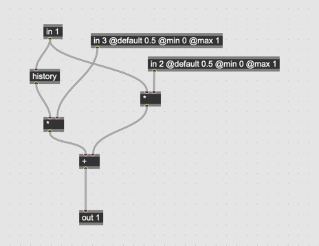

### FIR Filter cascading

y[n] = (a0 * x[n]) ± (a1 * x[n-1]) ± (a2 * x[n-2]) .... ± (ai * [x[n-i]])

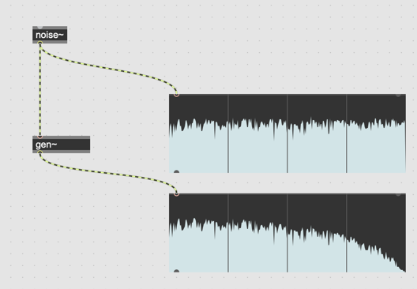


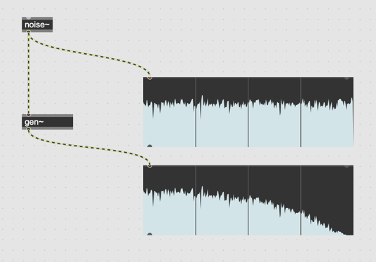

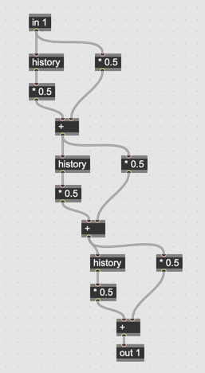

## IIR Filter

### Recursive Low Pass

y[n] = (0.5 * x[n]) + (0.5 * y[n-1])

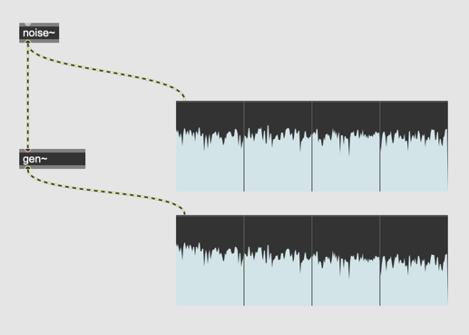
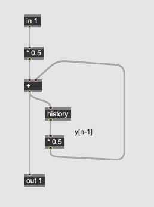

y[n] = (a * x[n]) - (b *[n-1])


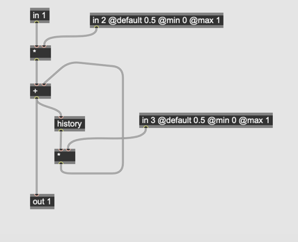

```
increasing b raises the highpass cutoff frequency, attenuating more and more low frequency
```

### Recuesive High Pass

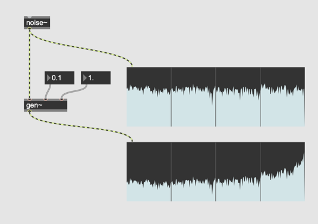


### Umsetzung von biquad~ mit gen~

Biquad = zwei FIR + zwei IIR

y[n] = a0 * x[n] + a1 * x[n-1] + a2* x[n-2] -b1 * y[n-1] -b2 * y[n-2]


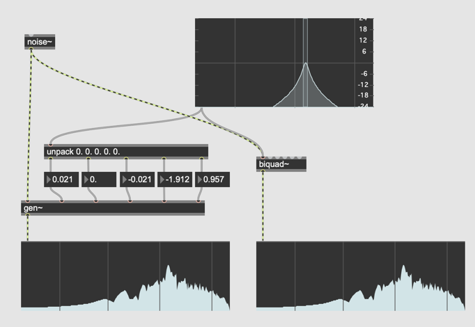
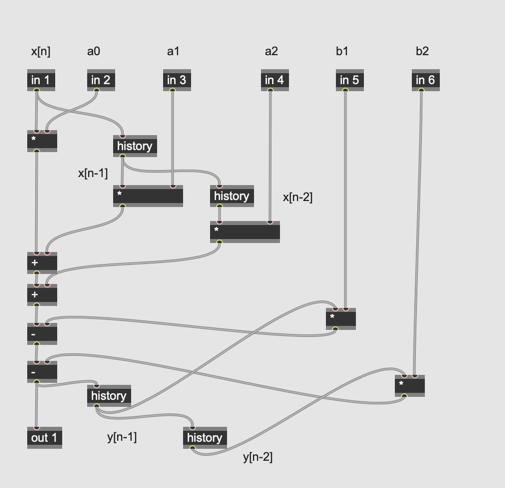
