# Klasse7

### Zero Crossing

zerox~ zählt "zero crossing".

### Noise-Erkennung

### Waveset

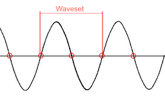

Trevor Wishart defined a **waveset** as **the signal between two zerocrossings**. For a simple sinusoid, this corresponds to the **waveform** (= wavelength) . But for signals of richer harmonic content, it produces more complex artefacts.

### Waveset Erkennung 

### Waveset Erkennung mit Additive-Synthese

### Waveset Erkennung mit Sample

### Waveset Distortion

Waveset distortion was developed for the CDP while composing [Tongues of Fire](https://www.youtube.com/watch?v=x-Or7VaMlEI). I defined a waveset as the signal between any pair of zero-crossings. With a simple sine-wave the waveset corresponds to the waveform. But even with a harmonic tone with very strong partials, the waveform may cross the zero more than twice in a complete cycle. In this case the wavesets are shorter than the waveform. With complex signals (e.g. speech) containing noise elements, the definition of the waveset produces many varieties of technically arbitrary, but potentially musically interesting, artefacts. A whole suite of procedures was developed to manipulate wavesets. I have used three at prominent moments in compositions.

-- Trevor Wischart

#### 1. Waveset-Erkennung 

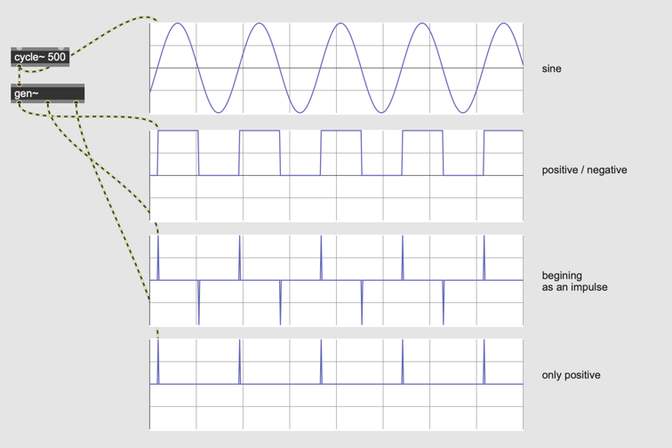

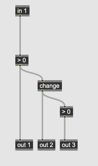

Mehrere Impulse pro Periode
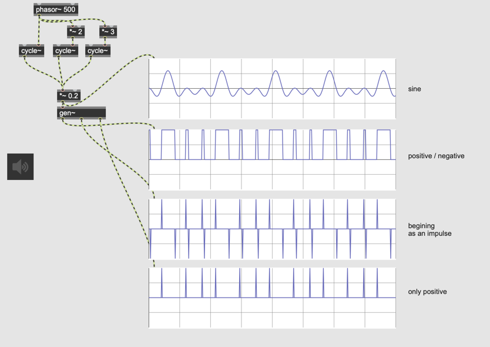

#### 2. Waveset-Intervallerkennung 

##### Z￿ähler
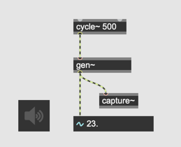

##### zu f￿r￿üh zu resetten

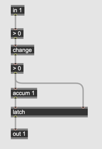

##### mit history

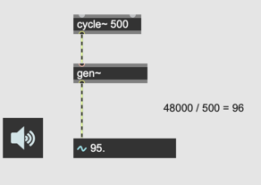

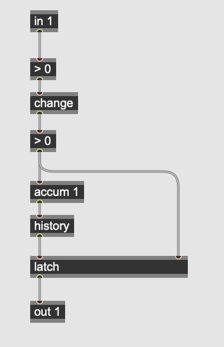

##### Ausgleich mit +1

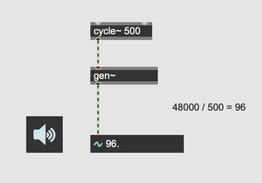

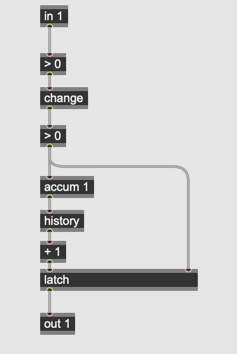

#### 3. mit Beschr￿änkung

wenn das System z.B. 1 Min. kein Signal bekommt, interpretiert das System 60 Sek. als Intervall und ersetzt dieses Intervall durch einen 0.016 Hz. Sinus (Unh￿örbar)

H￿örbereich 20 Hz - 20 kHz  
20 Hz ... 50 Msek ... 2400 Samples
 

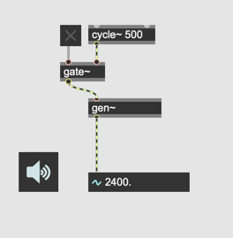

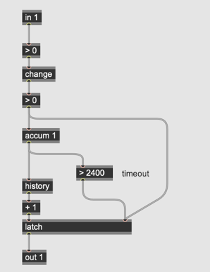

#### 4. Aufnahme von Intervalle

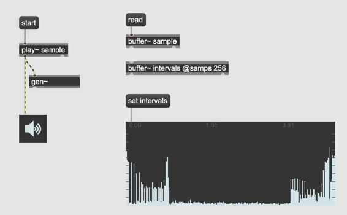

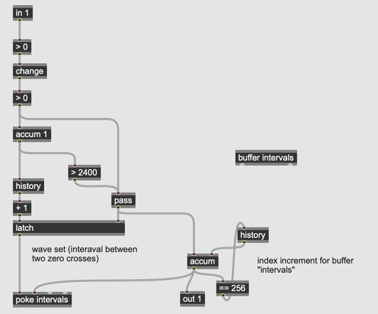

#### 5. Wiedergabe

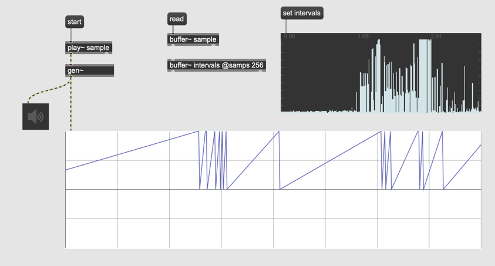

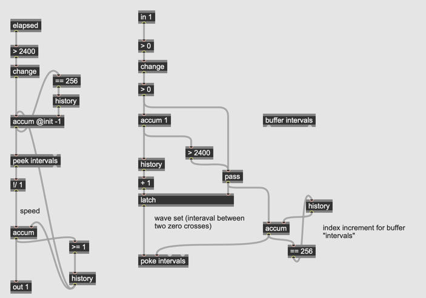

#### 6. Ersatz durch Sinus

The first of these involves replacing each waveset with a standard-shape waveform (e.g. a **sinewave**). This produces a very pronounced spectral transformation of the source, but one where the zero-crossings of the result are exactly aligned with those of the source. It is thus possible to use a simple mixing procedure (another CDP process, Inbetweening, does this) to produce a sequence of sounds intermediate between the source and the new sound. These two procedures were developed and used to produce the 'Wood' to 'Drum' transformations in [Tongues of Fire](https://www.youtube.com/watch?v=Ude4717dlsQ).

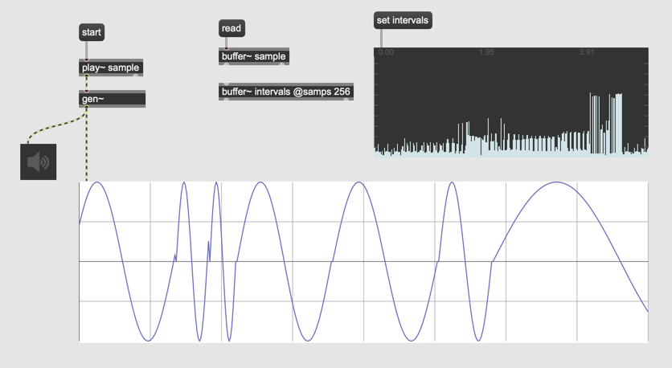

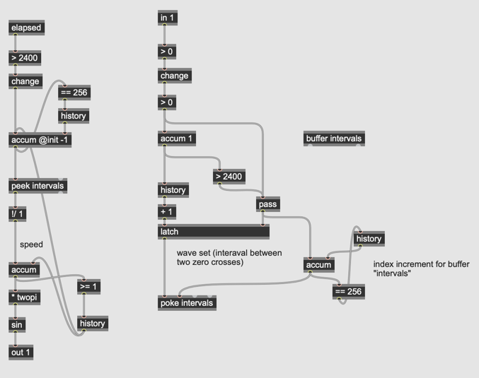

#### 7. Envelop Follower

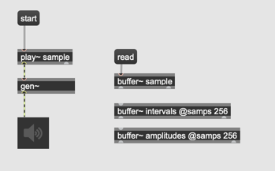

#### 8. Weitere Ideen

##### Pulser Synthese in WaveSet

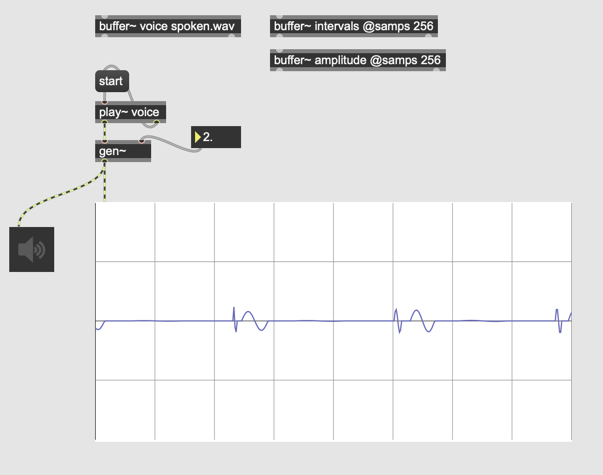
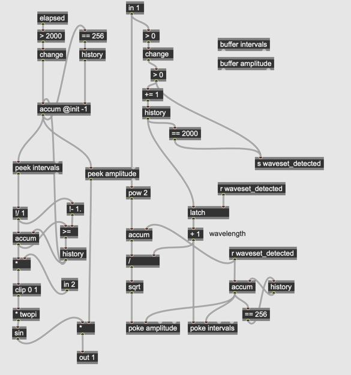

##### Additive Synthese in WaveSet

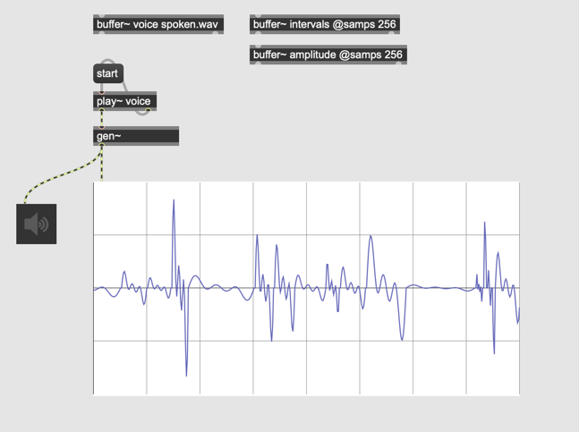
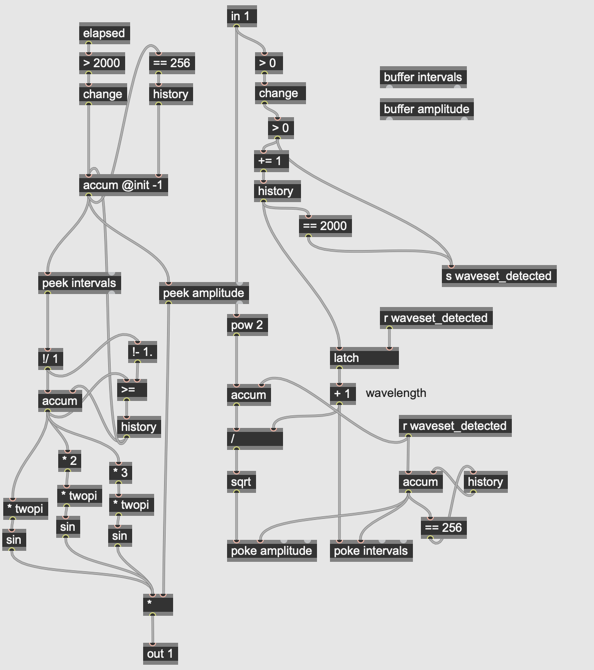